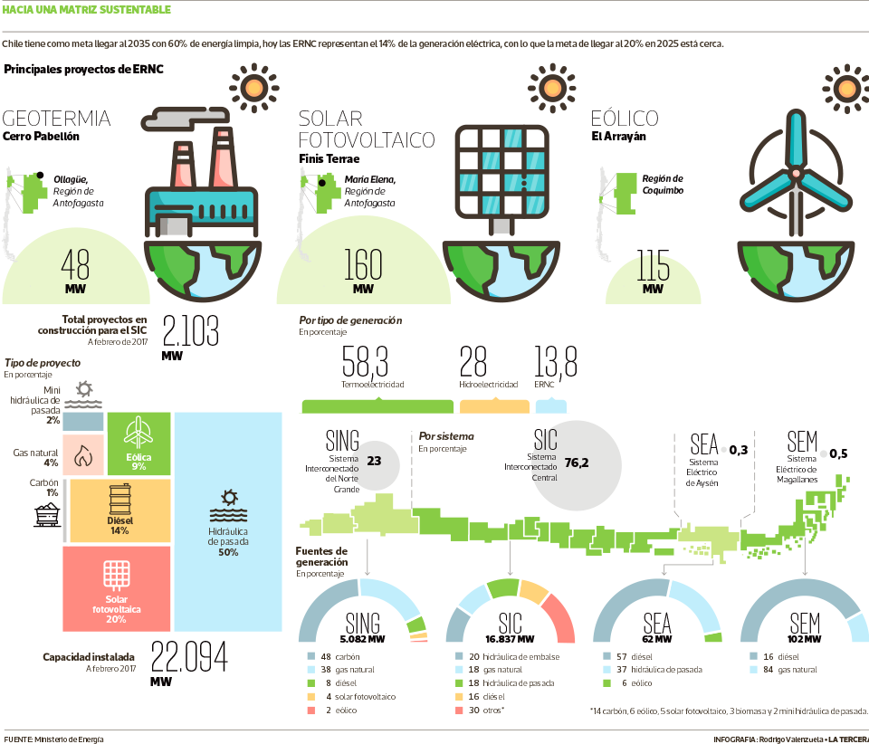

## Acerca de la empresa
Énizer es una empresa chilena de investigación y asesoramiento de tecnologías de energías renovables, con una fuerte convicción de que las energías de combustión deben ser reemplazadas en su mayor medida.
Énizer busca ser un referente latino americano, en cuanto el uso e investigación de energías renovables.
### Acerca de su origen
Énizer se forma en Chile, un país privilegiado en posibilidades de generación de energías renovables (http://www.energia.gob.cl/energias-renovables), cuenta con la radiación solar más alta del mundo, fuertes vientos de norte a sur para desarrollar energía eólica, un tremendo potencial de energía marina en sus costas, gran capacidad para desarrollar biogás y un recurso geotérmico a lo largo de su cordillera.
Para el 21 de Abril del año 2017, el diario nacional La Tercera, público un árticulo en el cual contenía la siguiente infografía, esta muestra como esta distribuida a la fecha la matriz energética Chilena.

[Imagen obtenida de La Tercera](http://www.latercera.com/noticia/17-la-energia-producida-chile-proviene-fuentes-renovables-no-convencionales/)

En esta imagen podemos percatarnos, que si bien es cierto existen energías renovables en uso, aun falta bastante para lograr dejar la dependencia de los hidrocarburos.
### Necesidad a cubrir
Dado que **Chile esta buscando dejar su dependencia de los hidrocarburos**, y en Énizer se cree firmemente que esto debe ser así. **Énizer busca contribuir a este objetivo país** y lograr que el país sea visto como un referente a seguir en materias energéticas.
### Misión
Buscamos ser un lider y un referente en el mercado para el diseño, investigación y desarrollo de energías renovables. Enfocados en la excelencia de nuestros procesos de investigación y desarrollo, queremos entregar el mejor servicio en el área de las energías renovables.
### Visión
Énizer es una empresa referente en latino américa en la generación e investigación de energías renovables. con un fuerte énfasis en la excelencia y contribución con el medio ambiente.
### Valores
#### Excelencia
Sea investigación como implementación, se operará con los máximos estándares, para lograr obtener los mejores resultados.
#### Concientes con el medio ambiente
Conciencia con el medio ambiente y con la situación desfavorable que el uso de los hidrocarburos nos provocan.
### Acerca de la estrategia
#### Propuesta de valor
* Desarrollo y asesoramiento de excelencia en tecnologías renovables.
* Generación de optimizaciones en el uso de energías renovables por medio de la investigación.
#### Clientes y usuarios
* Gobiernos interesados en la implementación de políticas energéticas renovables e industrias interesadas en la generación
* De implementarlo una industria, los usuarios serán la misma industria y sus clientes, de ser el gobierno, serán a quien este dirigido por los objetivos del gobierno en particular (Uso militar, industrial, comercial o país)
#### Canales de comunicación
* Foros de energía renovables.
* Página web.
* Publicidad.
* Lobby.
#### Aliados estratégicos
* Ministerios de energía.
* Universidades.
#### Ingresos
* Por medio de consultorias.
* Por medio de venta de tecnología patentada por Énizer.
#### Egresos
* Pago de arriendos de espacios de trabajo.
* Pago en investigación y desarrollo.
* Pago de patentes.

### Areas de interés estratégico
Las areas en la que Énizer se concentrará son las siguientes:
* Investigación: Con el objetivo de crear tecnología patentada
* Relaciones públicas: Con el fin de conseguir buenas relaciones con universidades y ministerios de energía.
* Consultorias: Con el fin de entregar soluciones de calidad y adecuadas al contexto.

### Objetivos estratégicos
#### Objetivos en investigación
* Innovar en energías renovables.
* Creación de patentes que tengan relación con energías renovables.
#### Objetivos en relaciones públicas
* Crear y mantener relaciones con universidades.
* Crear y mantener relaciones con gobiernos.
#### Objetivos en consultorias
* Entregar las mejores consultorías.
* Capacitación continua del personal.

### Análisis FODA
#### Análisis interno
##### Fortalezas
* **F1**: Fuerte convicción acerca de que el cambio hacia energías renovables hay que realizarlo con excelencia.
##### Debilidades
* **D1**: Pocos contactos con universidades y gobiernos.
#### Análisis externo
##### Oportunidades
* **O1**: Tendencia de dejar las energías obtenidas por hidrocarburos, por energías renobables.
##### Amenazas
* **A1**: Gobierno cambie su política a solo uso de hidrocarburos por motivos políticos.

### Plan estratégico
#### Inversión en capacitaciones
Cada persona contratada, independiente de su nivel de conocimiento y expertis, será capacitada en los diferentes conocimientos de cada una de las energías renovables, con el objetivo de dar las mejores consultorias y lograr los avances más significativos en en investigación.
#### Creación de imagen corporativa
Crear y mantener las relaciones con gobiernos y universidades en base de una imagen de una corporación de excelencia y confiable, para de esa manera conseguir financiamiento para investigación e ingreso monetario por medio de consultorias especializadas.
