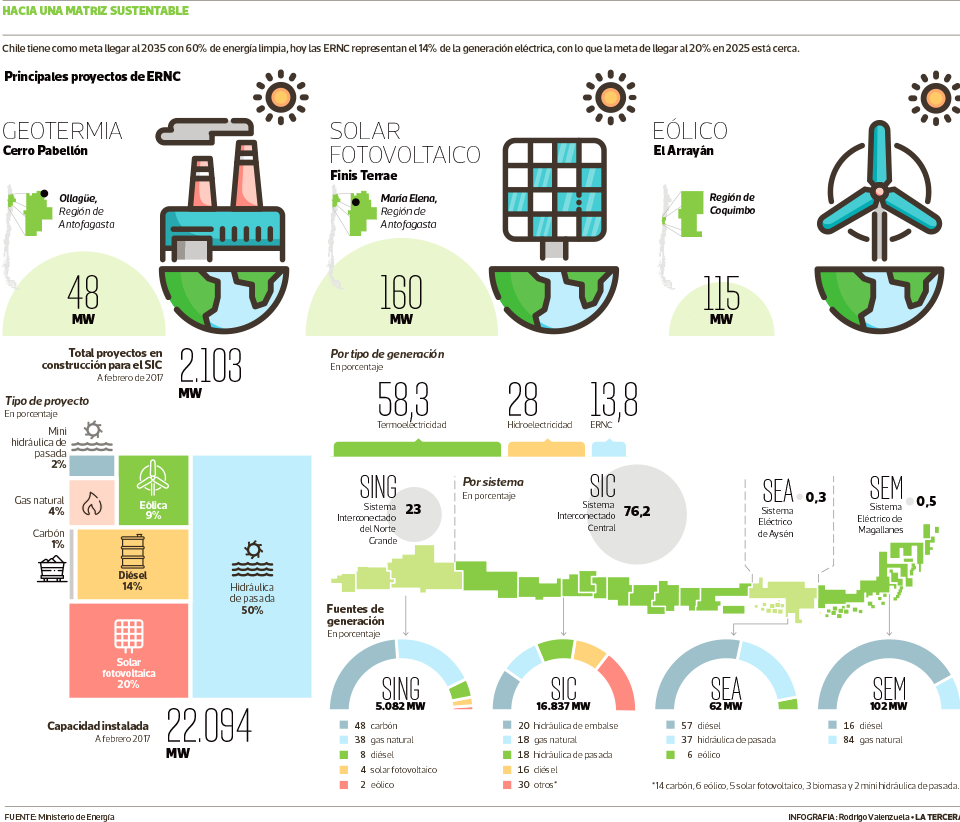

## Acerca de la empresa
Énizer es una empresa chilena de investigación e implementación de tecnologías de energías renovables, con una fuerte convicción de que las energías de combustión deben ser reemplazadas en su mayor medida.
Énizer busca ser un referente latino americano, en cuanto el uso e investigación de energías renovables.
### Acerca de su origen
Énizer se forma en Chile, un país privilegiado en posibilidades de generación de energías renovables (http://www.energia.gob.cl/energias-renovables), cuenta con la radiación solar más alta del mundo, fuertes vientos de norte a sur para desarrollar energía eólica, un tremendo potencial de energía marina en sus costas, gran capacidad para desarrollar biogás y un recurso geotérmico a lo largo de su cordillera.
Para el 21 de Abril del año 2017, el diario nacional La Tercera, público un árticulo en el cual contenía la siguiente infografía, esta muestra como esta distribuida a la fecha la matriz energética Chilena.

[Imagen obtenida de La Tercera](http://www.latercera.com/noticia/17-la-energia-producida-chile-proviene-fuentes-renovables-no-convencionales/)
En esta imagen podemos percatarnos, que si bien es cierto existen energías renovables en uso, aun falta bastante para lograr dejar la dependencia de los hidrocarburos.
### Necesidad a cubrir
Dado que **Chile esta buscando dejar su dependencia de los hidrocarburos**, y en Énizer se cree firmemente que esto debe ser así. **Énizer busca contribuir a este objetivo país** y lograr que el país sea visto como un referente a seguir en materias energéticas.
### Misión
Somos una empresa de investigación e implementación en energías renovables, con un fuerte énfasis en la excelencia y contribución con el medio ambiente.
### Visión
Énizer es una empresa referente en latino américa en la generación e investigación de energías renovables. con un fuerte énfasis en la excelencia y contribución con el medio ambiente.
### Valores
#### Excelencia
Sea investigación como implementación, se operará con los máximos estándares, para lograr obtener los mejores resultados.
#### Concientes con el medio ambiente
Conciencia con el medio ambiente y con la situación desfavorable que el uso de los hidrocarburos nos provocan.
